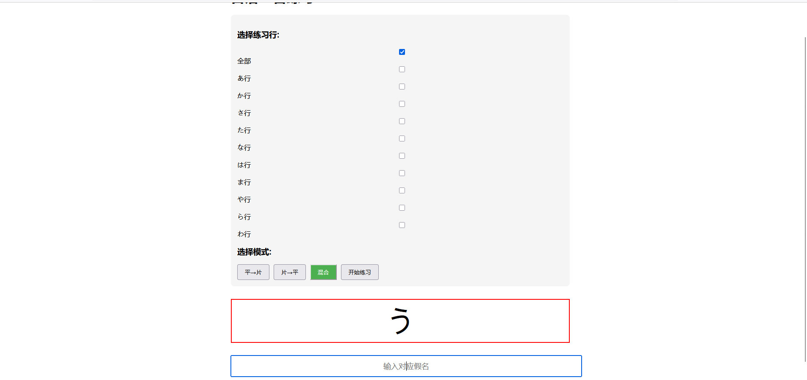

# 简介

本项目开发了一个简易的日语50音练习程序

它会随机生成平假名/片假名，并要求你输入对应的的片假名/平假名

并实时统计正确率与用时

# 使用方法

如果你的电脑没有python环境，可以直接使用我[打包好的exe](https://github.com/liuxiangchao369/japanese-50-tone-practice/releases/download/V1.0.0/hiragana_katakana_trainer.exe)


运行`hiragana_katakana_trainer.exe`之后打开浏览器，在地址栏输入


[localhost:5000](http://127.0.0.1:5000)

即可开始使用


如果你有开发基础，可以继续往下读:


## 安装python包

```shell
pip install -r requirements.txt
```

或

```
pip install Flask==3.1.0
```
## 运行

有两种模式，控制台模式和网页模式，二选一运行即可

### 命令行模式

```shell
python src/hiragana_katakana_trainer_terminal.py
```

### 网页模式（推荐）

```shell
python app.py
```
然后浏览网页

[localhost:5000](http://127.0.0.1:5000)
# 截图



